<div id="top" align="center">

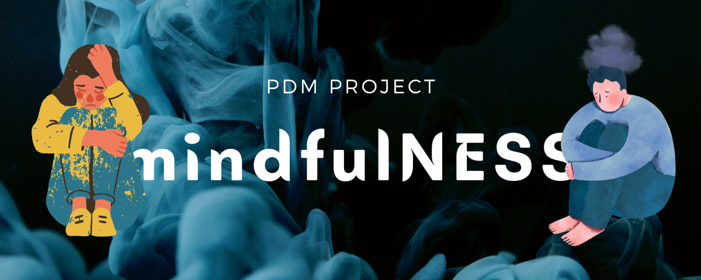

</div>
<!-- PROJECT LOGO -->
<div align="center">
<h1 align="center">mindfulNESS</h1>
  <h3 align="center">
    A mental healthcare services system for Principles of Database Management course at International University - VNU
    <br />
    <br />
    <a href="https://github.com/itzmealvin/PDM_mindfulNESS_PC/issues">Report Bug</a>
    ·
    <a href="https://github.com/itzmealvin/PDM_mindfulNESS_PC/issues">Request Feature</a>
  </h3>

[![Contributors][contributors-shield]][contributors-url]
[![Forks][forks-shield]][forks-url]
[![Issues][issues-shield]][issues-url]

</div>

<!-- About -->

# ABOUT 👀

## 1. The team behind it

| No. |       Full Name       | Student's ID |              Email               |                      Github account                      |    Roles    | 
|:---:|:---------------------:|:------------:|:--------------------------------:|:--------------------------------------------------------:|:-----------:|
|  1  |  Nguyen Hoang Anh Tu  | ITDSIU20090  | ITDSIU20090@student.hcmiu.edu.vn |        [nghganhtu](https://github.com/nghganhtu)         | TEAM LEADER | 
|  2  |   Nguyen Quang Dieu   | ITDSIU20031  | ITDSIU20031@student.hcmiu.edu.vn |       [itzmealvin](https://github.com/itzmealvin)        | TEAM MEMBER | 
|  3  | Nguyen Luan Cong Bang | ITITIU20163  | ITITIU20163@student.hcmiu.edu.vn |     [congbangitiu](https://github.com/congbangitiu)      | TEAM MEMBER |
|  4  |     Pham Minh Vu      | ITITIU20354  | ITITIU20354@student.hcmiu.edu.vn |          [PMinhVu](https://github.com/PMinhVu)           | TEAM MEMBER | 
|  5  |   Huynh Tran Khanh    | ITCSIU21011  | ITCSIU21011@student.hcmiu.edu.vn | [huynhtrankhanh](https://gist.github.com/huynhtrankhanh) | TEAM MEMBER | 

## 2. The project we are working on

The mental healthcare service system **mindfulNESS** involves professional resources to promote mental healthcare and
treat
mental illnesses. It includes many services such as disease search, disease testing, and appointment booking with a
consultant.

The project provided a valuable opportunity to apply **database management principles** to a real-world problem in the
field of mental health. It showcased the practical application of database management principles in addressing
challenges in
mental health.

To be short, the project aims to:

- []() Create a game that is redesigned to entertain and educate players.

- []() Practicing OOP techniques in the Theory class.

- []() Go through the process of game management and code refining.

- []() Evaluate the ability to build more features on top of the basic code.

## 3. Task distribution


| Order | Tasks                             |   Member   | Contribution |
|:------|:----------------------------------|:----------:|:------------:|
| 1     | Database Developer, Data Analyst  |   Anh Tu   |     20%      |
| 2     | Interface Developer, Data Analyst | Quang Dieu |     20%      |
| 3     | Interface Developer               | Cong Bang  |     20%      |
| 4     | Interface Developer               |  Minh Vu   |     20%      |
| 5     | Interface Developer               | Tran Khanh |     20%      |


<!-- REASON -->

# REASON 🩺

## 1. Motivation

The global pandemic has profoundly impacted mental health, resulting in increased recognition of the importance of
psychological therapy. However, accessing traditional therapy can still be challenging for many people due to factors
such as long wait-lists, high costs, and the enduring stigma associated with mental health

## 2. Idea

To address these barriers and meet the growing demand for mental health services, online therapy platforms have
emerged as a popular and accessible option. These platforms offer a wide range of mental health services. One of the
critical advantages of online therapy is its flexibility, allowing individuals to schedule sessions at their
convenience and receive therapy from the comfort of their homes. They also offer more affordable pricing than
traditional in-person therapy, making therapy accessible to a broader audience.

Among the well-known online therapy platforms are BetterHelp, Talkspace, and Amwell. BetterHelp provides various
therapy options, including live sessions, messaging, and chat support. Talkspace specializes in unlimited messaging
therapy with licensed therapists. On the other hand, Amwell offers mental health services as part of its broader
telehealth platform, including access to medical doctors and specialists.

## 3. Roadmap

- [x] There are 2 distinct roles: patient and consultant for users to choose from
- [x] The system allows patients to search for diseases and take health tests with real scores and solutions
- [x] Patients can make an appointment with a specialist if their illness is severe
- [ ] More to come...

Please see the [open issues](https://github.com/itzmealvin/PDM_mindfulNESS_PC) for a full list of proposed features (
and known issues).

<!-- METHODOLOGY -->
<br />


## 4. Techniques

Language: [SQL Server](https://www.microsoft.com/en-us/sql-server/sql-server-downloads), [Java](https://www.java.com/en/)

- Compiler: [IntelliJ](https://www.jetbrains.com/idea/), [Visual Studio Code](https://code.visualstudio.com)
- ERD drawing platform: [Draw.io](https://app.diagrams.net/)
- Library: [JavaSwing](https://openjfx.io)
- Online database storage: [ASP hosting](http://freeasphosting.net/)


# HOW TO USE


- **Login page**: Require users to enter the correct account and password to log in for people who have used the system,
  sign up for first time users of the system, or explorer mode for system administrators
  <br />

<div align="center">
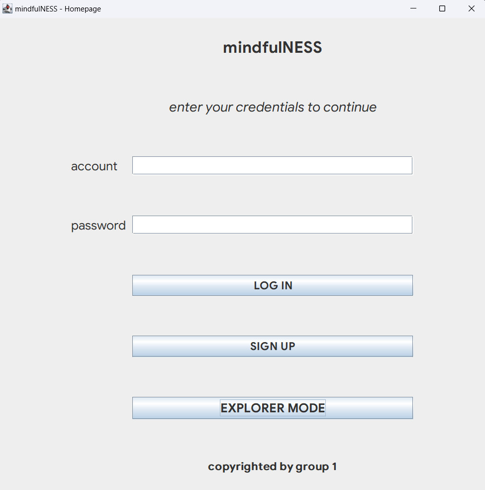
</div>

<br />

- **Patient Dashboard**: When the user logs in with the patient's account, this page will appear
  <br />

<div align ="center">
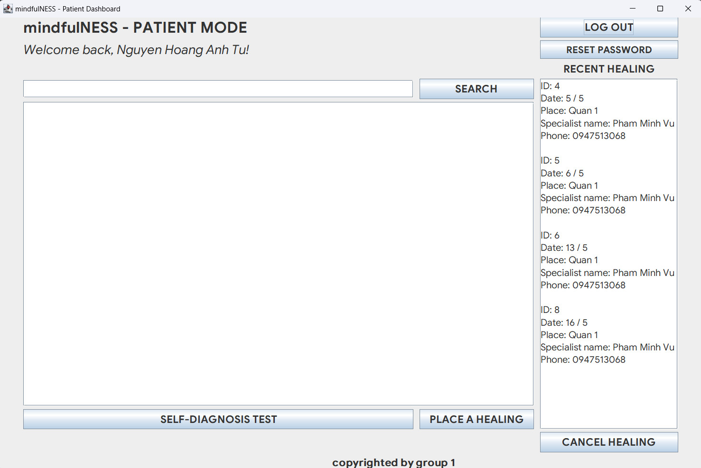
</div>

<br />

- When the user types the name of the disease and clicks the "SEARCH" button, the symptoms as well as the cure will
  appear
  <br />

<div align ="center">
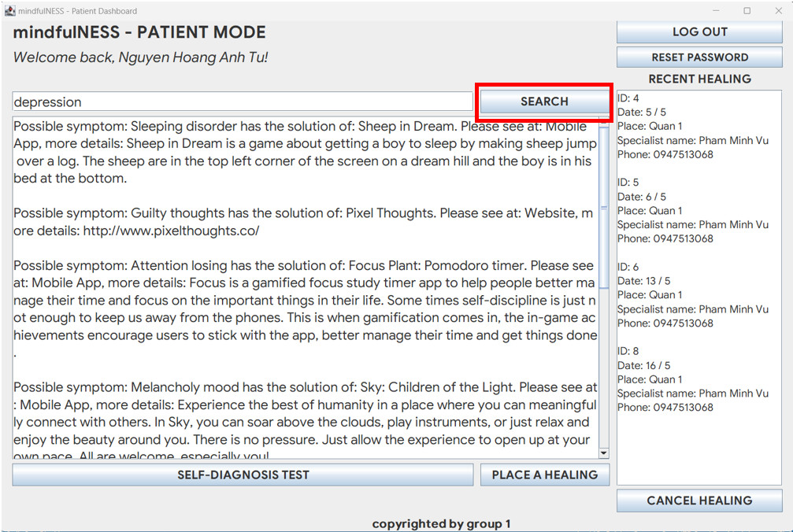
</div>

<br />

- When the user clicks the "CANCEL HEALING" button, the system will ask for the ID of the meeting that the user wants to
  cancel
  <br />

<div align ="center">
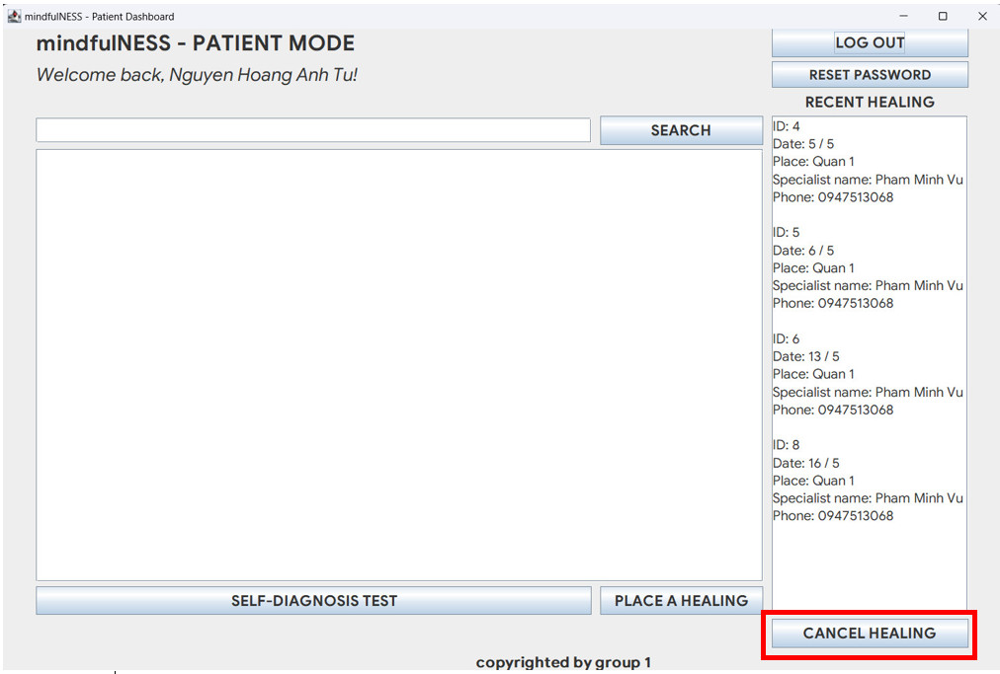
</div>

<br />

- **Self-dianosis test**: When the user clicks the "SELF-DIANOSIS TEST" button in the patient dashboard, the system will
  redirect to the test page for the user to take the test. The user will choose the test set and choose the question to
  answer, after answering all the questions, the score and solution will appear.
  <br />

<div align ="center">
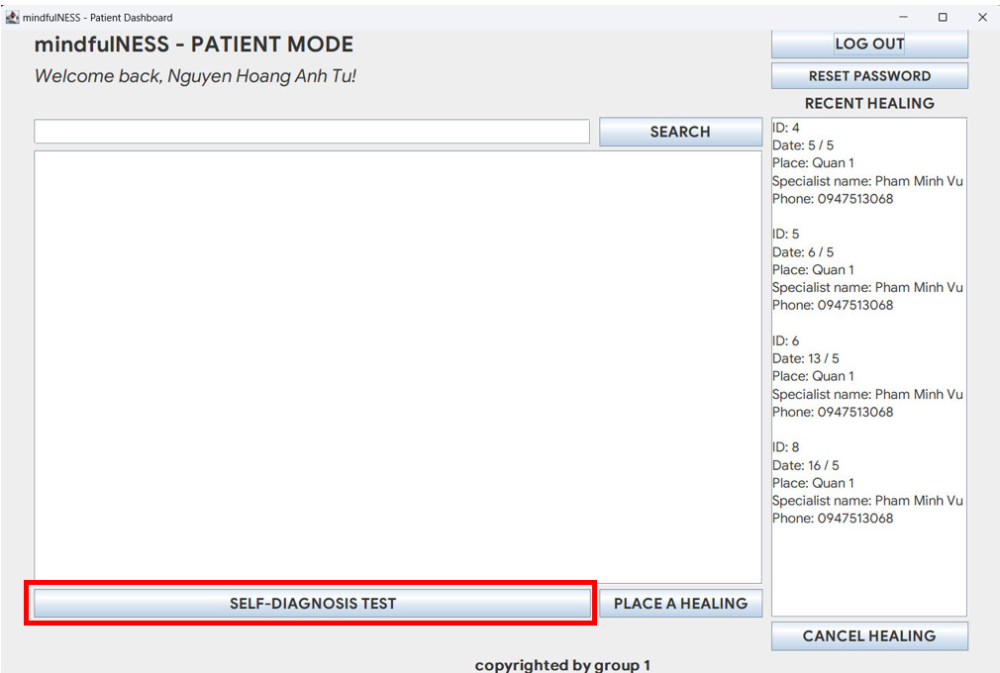
</div>

<br />

<br />
<div align ="center">
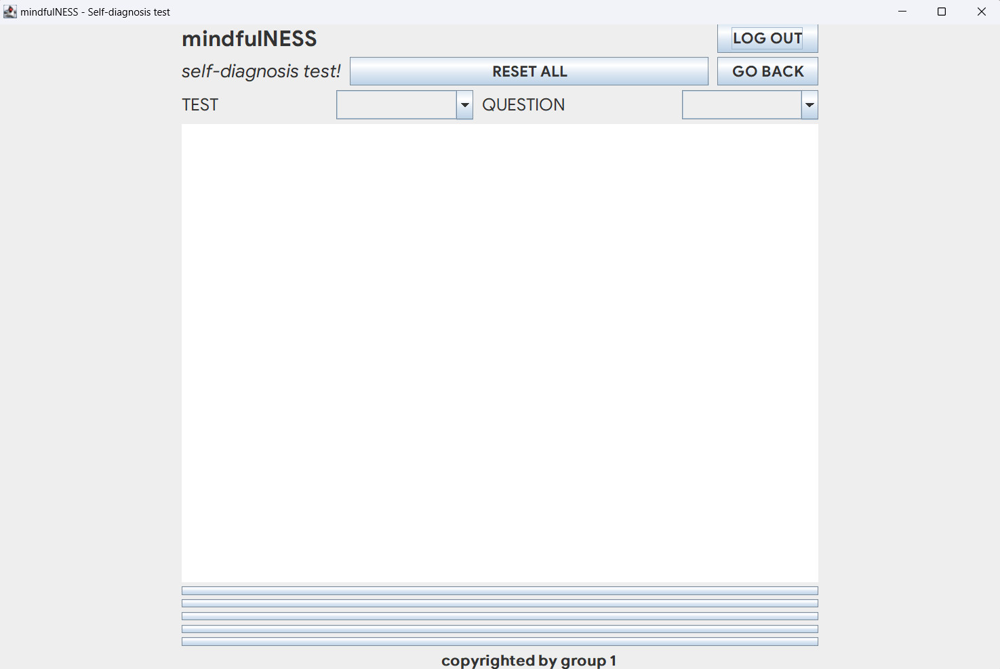
</div>
<br />

<br />

<div align ="center">

</div>
<br />

- **Booking healing**: When the user clicks the "PLACE A HEALING" button in the patient dashboard, the system will
  redirect to the booking page to let the user book an appointment with the specialist. The user will enter the ID of
  the booklist and press the "PLACE A HEALING" button to confirm the meeting
  <br />

<div align ="center">
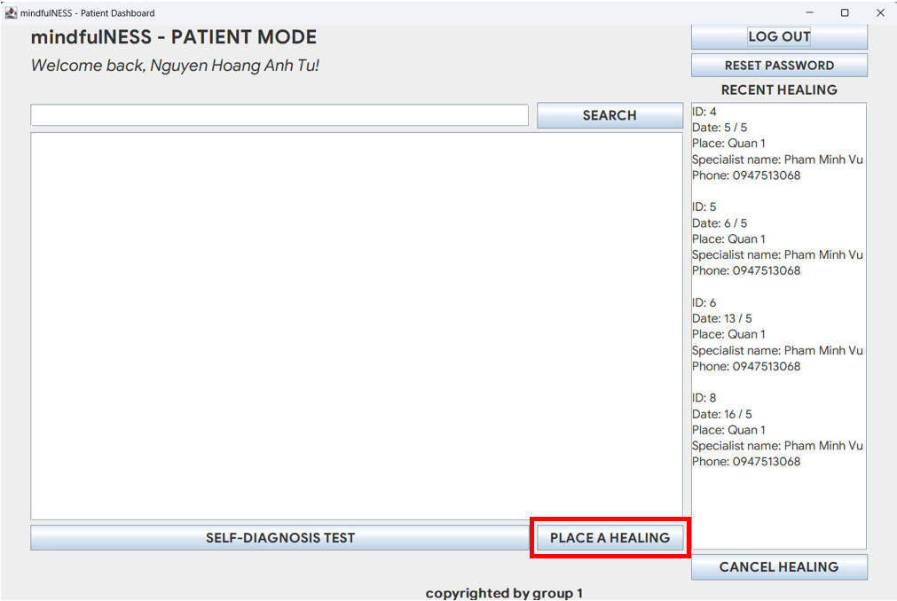
</div>

<br />

<div align ="center">
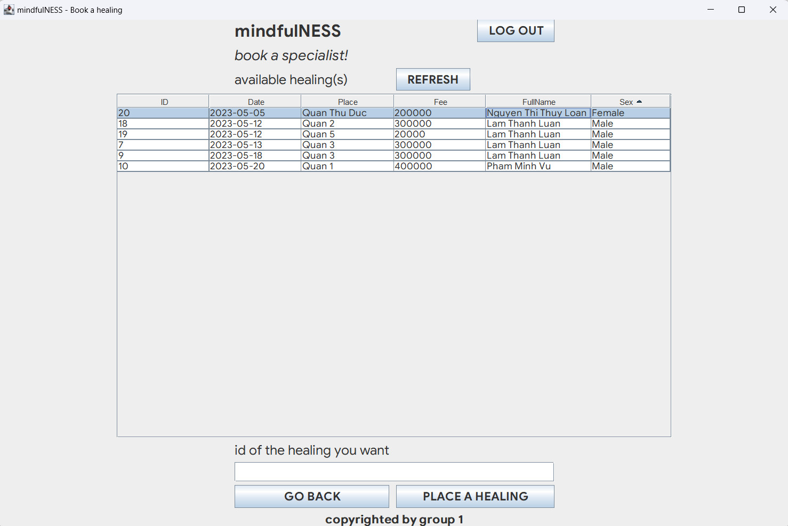
</div>
<br />

- **Specialist mode**: When the expert enters all the required information and presses the "POST BOOKING INFORMATION"
  button, the information will be displayed on the right meeting table. If the user wants to delete the meeting, press
  the "DELIST HEALING" button
  <br />

<div align ="center">
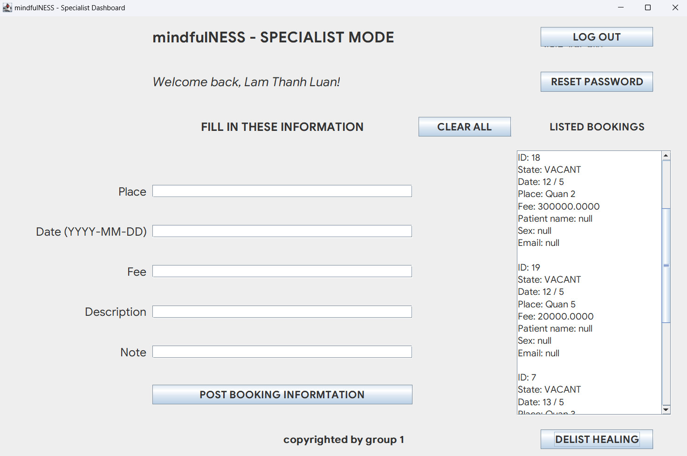
</div>

<br />

- **Sign up mode**: If the user presses the "SIGN UP" button, the system will ask the user to select his role and enter
  the correct and complete information
  <br />

<div align ="center">
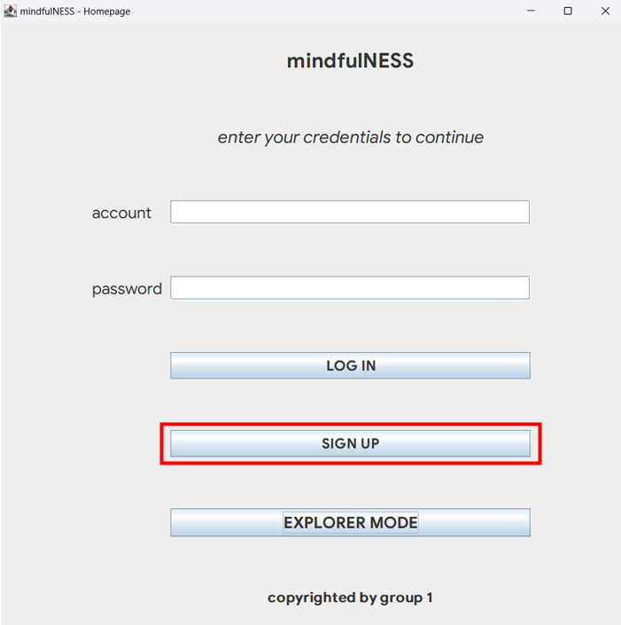
</div>

<br />

<br />
<div align ="center">
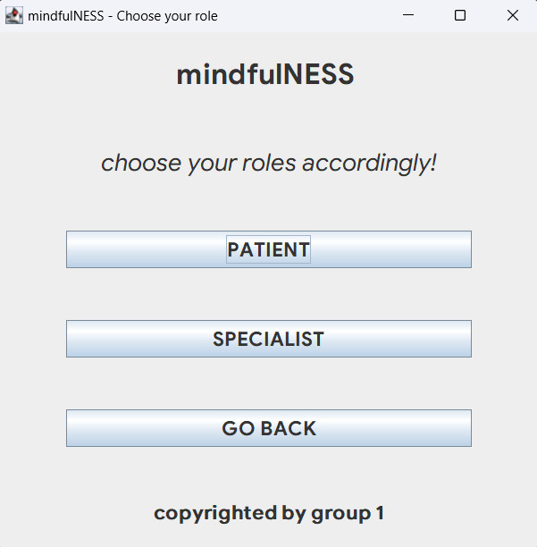
</div>
<br />

- **Explorer mode**: Only administrators need to use this mode to manage databases
  <br />

<div align ="center">
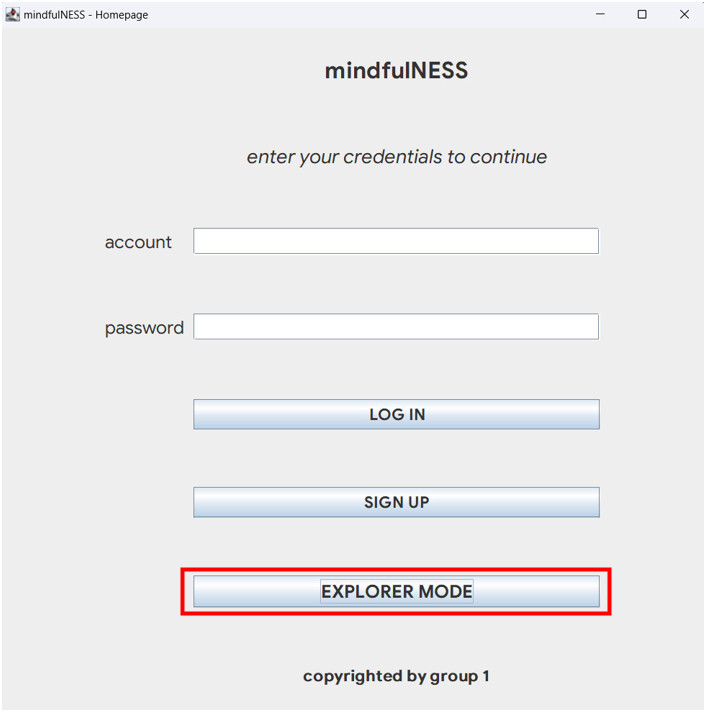
</div>

<br />
<br />

# ENTITY RELATIONSHIP DIAGRAM (ERD) 📚

<br />
<div align ="center">
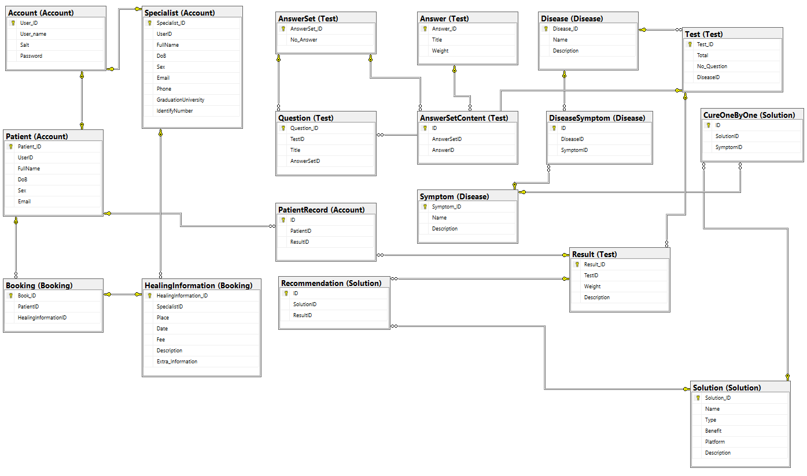
</div>

<br />

<br />
<div align ="center">
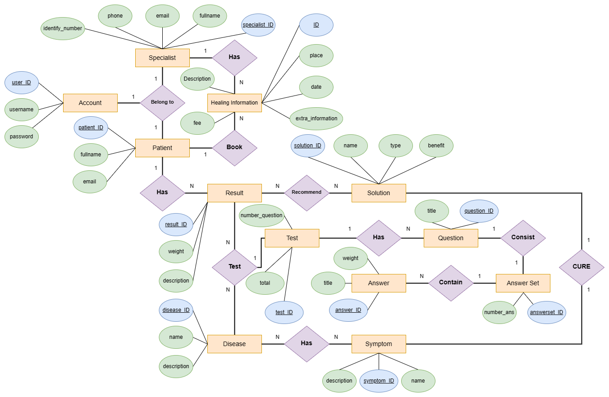
</div>
<br />

<br />


<!-- INSTALLATION -->

# INSTALLATION 💊

### Required software

* Java Development Kit (i.e. OpenJDK) [CLICK TO DOWNLOAD](https://openjdk.org/)
* Any Java IDE (i.e. JetBrains Intellij IDEA) [CLICK TO DOWNLOAD](https://www.jetbrains.com/idea/download/)
* SQL Server [CLICK TO DOWNLOAD](https://www.microsoft.com/en-us/sql-server/sql-server-downloads)

### Steps

1. Clone the repo
   ```sh
   git clone https://github.com/itzmealvin/PDM_mindfulNESS_PC
   ```
2. Open in a Java IDE
3. Choose **mindfulNESS.java** and click RUN to play the game

<br />
<br />


<!-- CONTRIBUTING -->

# CONTRIBUTING 🌱

Contributions are what make the open source community such an amazing place to learn, inspire, and create. Any
contributions you make are **greatly appreciated**.

If you have a suggestion that would make this better, please fork the repo and create a pull request. You can also
simply open an issue with the tag "enhancement".
Don't forget to give the project a star! Thanks again!

1. Fork the Project
2. Create your Feature Branch (`git checkout -b feature/AmazingFeature`)
3. Commit your Changes (`git commit -m 'Add some AmazingFeature'`)
4. Push to the Branch (`git push origin feature/AmazingFeature`)
5. Open a Pull Request

<-- CONTACT-->

# CONTACT

Nguyen Hoang Anh Tu by **[Email HERE](ITDSIU20090@student.hcmiu.edu.vn)**

Project Link: [https://github.com/itzmealvin/PDM_mindfulNESS_PC](https://github.com/itzmealvin/PDM_mindfulNESS_PC)

<!-- ACKNOWLEDGMENTS -->

# ACKNOWLEDGEMENTS 

We want to express our sincerest thanks to our lecturer and the people who have helped us to achieve this project's
goals:

- []()    Assoc. Prof. Nguyen Thi Thuy Loan
- []()    MSc. Nguyen Quang Phu
- []()    The README.md template from **[othneildrew](https://github.com/othneildrew/Best-README-Template)**

<!-- MARKDOWN LINKS & IMAGES -->

[contributors-shield]: https://img.shields.io/github/contributors/itzmealvin/PDM_mindfulNESS_PC.svg?style=for-the-badge

[contributors-url]: https://github.com/itzmealvin/PDM_mindfulNESS_PC/graphs/contributors

[forks-shield]: https://img.shields.io/github/forks/itzmealvin/PDM_mindfulNESS_PC.svg?style=for-the-badge

[forks-url]: https://github.com/itzmealvin/PDM_mindfulNESS_PC/network/members

[issues-shield]: https://img.shields.io/github/issues/itzmealvin/PDM_mindfulNESS_PC.svg?style=for-the-badge

[issues-url]: https://github.com/itzmealvin/PDM_mindfulNESS_PC/issues


